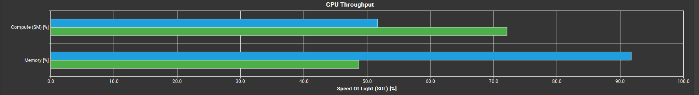
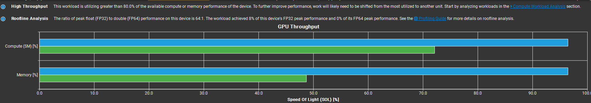
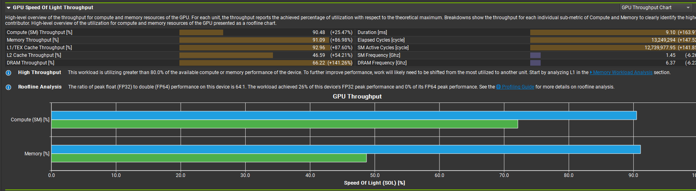
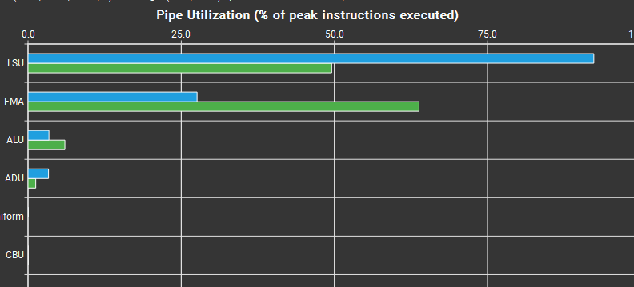
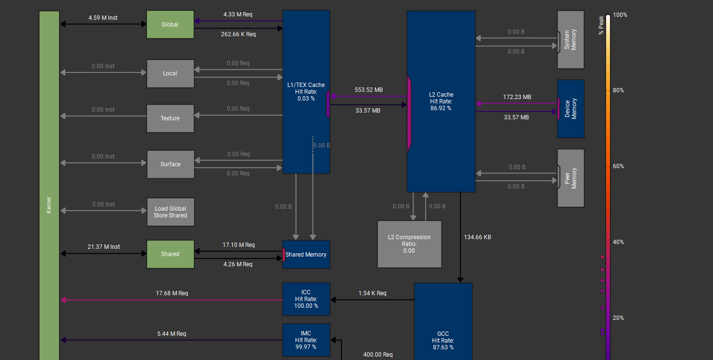

# Optimizing CUDA Matrix Multiplication to 92% of cuBLAS

A deep dive into GPU optimization techniques, progressively improving a naive GEMM implementation from **280 GFLOPS to 5250 GFLOPS** (18.8× speedup, 92% of cuBLAS performance).

**Hardware:** NVIDIA RTX 3050 (8GB, Ampere Architecture)  
**Test Case:** 2048×2048 FP32 matrix multiplication

---

## 📊 Performance Summary

| Version | Optimization | GFLOPS | Speedup | % of cuBLAS |
|---------|-------------|--------|---------|-------------|
| v1 |  Naive          |  280     | 1.0×   | 5%  |
| v2 |Shared Memory Tiling| 736   | 2.6×   | 13% |
| v3 |Register Blocking | 2,400   | 8.6×   | 42% |
| v4 |Memory Vectorization| 4,200 | 15.0×  | 74% |
| v5 |Rectangular Tiling | 5,250  | 18.8×  | 92% |
| - | cuBLAS (reference) | 5,700  | 20.4×  | 100%|


*Speed of Light comparison: My best kernel vs cuBLAS*

---

## 🎯 Executive Summary

Starting from a textbook naive implementation running at just 280 GFLOPS (5% of cuBLAS), I systematically applied GPU optimization techniques, understanding each bottleneck through profiling and architectural analysis. The final kernel achieves **5250 GFLOPS (92% of cuBLAS)** through:

- Shared memory tiling for data reuse
- Register blocking for arithmetic intensity
- Memory coalescing via vectorization  
- Rectangular tiling for optimal register reuse
- K-loop unrolling for instruction-level parallelism


---

## 🔬 Optimization Journey

### Version 1: Naive Implementation (280 GFLOPS)

**The Baseline: What Every Tutorial Shows**

```cuda
__global__ void matmul_naive(float* C, const float* A, const float* B, 
                              int M, int N, int K) {
    int row = blockIdx.y * blockDim.y + threadIdx.y;
    int col = blockIdx.x * blockDim.x + threadIdx.x;
    
    if (row < M && col < N) {
        float sum = 0.0f;
        for (int k = 0; k < K; k++) {
            sum += A[row * K + k] * B[k * N + col];  // Global memory every iteration
        }
        C[row * N + col] = sum;
    }
}
```

**Why is this slow?**

1. **Massive global memory traffic**
   - Each thread reads an entire row of A (2048 floats)
   - Each thread reads an entire column of B (2048 floats)
   - Total: ~8 MB of global memory per thread
   - Memory bandwidth: ~20 GB/s (only 10% of 212 GB/s peak!)

2. **Zero data reuse between threads**
   - Thread (0,0) loads A[0,:] and B[:,0]
   - Thread (0,1) loads A[0,:] and B[:,1]
   - A[0,:] loaded twice! (Should share via SMEM)

3. **Low arithmetic intensity**
   - 2K FLOPs per thread
   - 8K bytes loaded
   - AI = 0.25 FLOP/byte (terrible!)

**Performance:**
- 280 GFLOPS (only 5% of cuBLAS)
- Memory bound (compute units are idle)


*Naive kernel showing low compute and memory utilization*

---

### Version 2: Shared Memory Tiling (736 GFLOPS) - 2.6× speedup

**The Classic Optimization: Block Data Reuse**

```cuda
#define TILESIZE 32

__global__ void matmul_tiled(float* C, const float* A, const float* B, 
                              int M, int N, int K) {
    __shared__ float As[TILESIZE][TILESIZE];
    __shared__ float Bs[TILESIZE][TILESIZE];
    
    int row = blockIdx.y * TILESIZE + threadIdx.y;
    int col = blockIdx.x * TILESIZE + threadIdx.x;
    
    float sum = 0.0f;
    
    
    int numTiles = cuda::ceil_div(K,tilesize);
    for (int t = 0; t < numTiles; t++) {
        // load into smem
        As[threadIdx.y][threadIdx.x] = A[row * K + t * TILESIZE + threadIdx.x];
        Bs[threadIdx.y][threadIdx.x] = B[(t * TILESIZE + threadIdx.y) * N + col];
        __syncthreads();
        
        //Compute using smem
        for (int k = 0; k < TILESIZE; k++) {
            sum += As[threadIdx.y][k] * Bs[k][threadIdx.x];
        }
        __syncthreads();
    }
    
    C[row * N + col] = sum;
}
```

**Why is this better?**

1. **Data reuse via shared memory**
   - Each A value loaded once, used 32 times (by 32 threads in the row)
   - Each B value loaded once, used 32 times (by 32 threads in the column)
   - **32× reduction in global memory traffic!**

2. **Faster memory access**
   - Shared memory latency: ~20 cycles
   - Global memory latency: ~400 cycles
   - 20× faster once data is in SMEM

3. **Improved arithmetic intensity**
   - Before: 0.25 FLOP/byte
   - After: 8 FLOP/byte (32× better!)

**Performance:**
- 736 GFLOPS (2.6× faster than naive)
- Memory bandwidth: ~60 GB/s
- **Still bottlenecked:** Each thread only computes 1 output


*Tiled kernel showing improved utilization but still room for improvement*

**Remaining problem:** Low work per thread = low ILP (instruction-level parallelism)

---

### Version 3: Register Blocking (2,400 GFLOPS) - 8.6× speedup

**The Next Level: Thread-Level Tiling**

**Key Change:** Each thread now computes REGTILE×REGTILE outputs (2×2 = 4 outputs) instead of just 1.

```cuda
#define TILESIZE 32
#define REGTILE 2  // Each thread computes 2×2 outputs

float c[REGTILE][REGTILE] = {0.0f};  // Stored in registers!

for (int k = 0; k < TILESIZE; k++) {
    float a[REGTILE], b[REGTILE];
    for (int i = 0; i < REGTILE; i++) {
        a[i] = As[ty * REGTILE + i][k];
        b[i] = Bs[k][tx * REGTILE + i];
    }
    
    // Outer product (all register operations, super fast!)
    for (int i = 0; i < REGTILE; i++) {
        for (int j = 0; j < REGTILE; j++) {
            c[i][j] += a[i] * b[j];
        }
    }
}
```

**Why is this better?**

1. **Higher arithmetic intensity**
   - Before: Each thread computes 1 output
   - After: Each thread computes 4 outputs (2×2)
   - 4× more compute per memory access

2. **Better register utilization**
   - Accumulators `c[][]` stay in registers (latency = 1 cycle!)
   - Compiler can pipeline operations (ILP)
   - Less SMEM pressure per output computed

3. **Reduced shared memory bandwidth**
   - Before: 2K SMEM reads per output
   - After: 2K SMEM reads for 4 outputs
   - 4× less SMEM bandwidth per output

**Performance:**
- 2,400 GFLOPS (8.6× faster than naive, 3.3× faster than tiled)
- Arithmetic intensity: 32 FLOP/byte
- Register usage: ~50 per thread

Upon first glance, register blocking seems like a massive success. Loading up Nsight Compute and seeing 91% compute and 92% memory utilization might lead you to believe that this is nearing the limits of the card. It's not - just the load and store pipeline nearing its limit (bad); FMA is what we want here. In comparison to cuBLAS, it's getting there, but now we just made ourselves memory bottlenecked, not what you want.


*Register blocking showing high utilization but wrong pipeline*


*Improved pipeline utilization with register blocking*

---

### Version 4: Memory Vectorization (4,200 GFLOPS) - 15× speedup

**Exploit Hardware: 128-bit Memory Transactions**

**Key Change:** Use `float4` to load/store 4 floats at once (128-bit transactions) and increase REGTILE to 4.

```cuda
#define TILESIZE 64
#define REGTILE 4  // Increased to 4 (perfect for float4)

// Vectorized load: 4 floats at once (128-bit transaction)
float4 a_vec = *reinterpret_cast<const float4*>(&A[...]);

// Write back 4 floats at once
float4 out = make_float4(c[i][0], c[i][1], c[i][2], c[i][3]);
*reinterpret_cast<float4*>(&C[...]) = out;
```

**Why is this better?**

1. **Coalesced memory access**
   - CUDA memory subsystem fetches in 128-byte chunks
   - 32 threads × 4 bytes = 128 bytes = perfect coalescing!
   - Before: 4 separate 32-bit transactions
   - After: 1 combined 128-bit transaction
   - **4× memory bandwidth efficiency**

2. **Reduced memory transactions**
   - Fewer L1/L2 cache lookups
   - Fewer DRAM requests
   - Memory bandwidth: ~140 GB/s

3. **Larger tile size (64 vs 32)**
   - More work per block
   - Better GPU utilization
   - Each thread computes 16 outputs (4×4)

**Performance:**
- 4,200 GFLOPS (15× faster than naive, 1.75× faster than register blocking)
- Register usage: ~70 per thread
- Block dimensions: 16×16 threads
- **Approaching cuBLAS, but still 26% gap!**


*Vectorized kernel approaching peak performance*

---

### Version 5: Rectangular Tiling (5,250 GFLOPS) - 18.8× speedup ⭐

**The Breakthrough: Non-Square Register Tiles**

**Key Insight:** 8×4 rectangular tiles beat 4×4 square tiles!

```cuda
#define TILESIZE 64
#define REGTILE_M 8  // More rows!
#define REGTILE_N 4  // Fewer columns

// Each thread computes 8×4 = 32 outputs (not 16!)
float c[REGTILE_M][REGTILE_N] = {0.0f};

// K-loop with unrolling (k += 4)
for (int k = 0; k < TILESIZE; k += 4) {
    // Cache 4 k-iterations worth of data
    float a0[REGTILE_M], a1[REGTILE_M], a2[REGTILE_M], a3[REGTILE_M];
    float b0[REGTILE_N], b1[REGTILE_N], b2[REGTILE_N], b3[REGTILE_N];
    
    // Load from SMEM (8 A-values × 4 = 32 loads)
    for (int i = 0; i < REGTILE_M; i++) {
        a0[i] = As[ty * REGTILE_M + i][k];
        a1[i] = As[ty * REGTILE_M + i][k + 1];
        a2[i] = As[ty * REGTILE_M + i][k + 2];
        a3[i] = As[ty * REGTILE_M + i][k + 3];
    }
    
    // Load from SMEM (4 B-values × 4 = 16 loads)
    for (int j = 0; j < REGTILE_N; j++) {
        b0[j] = Bs[k][tx * REGTILE_N + j];
        b1[j] = Bs[k + 1][tx * REGTILE_N + j];
        b2[j] = Bs[k + 2][tx * REGTILE_N + j];
        b3[j] = Bs[k + 3][tx * REGTILE_N + j];
    }
    
    // Compute 4 k-iterations at once (8×4×4 = 128 FMAs)
    for (int i = 0; i < REGTILE_M; i++) {
        for (int j = 0; j < REGTILE_N; j++) {
            c[i][j] += a0[i] * b0[j];
            c[i][j] += a1[i] * b1[j];
            c[i][j] += a2[i] * b2[j];
            c[i][j] += a3[i] * b3[j];
        }
    }
}
```

**Why is this the magic combination?**

1. **Better register reuse (the key insight!)**
   - **Square 4×4:** Load 4 A-values, 4 B-values → 16 outputs
   - **Rectangular 8×4:** Load 8 A-values, 4 B-values → 32 outputs
   - **Same B-values, but 2× more A-values = 2× work!**
   - Each B-value is reused with more A-values

2. **Optimal register usage**
   - Register count: ~90 per thread
   - Below spilling threshold (168 on RTX 3050)
   - 8×4×4 (unrolled) + temp arrays = perfect fit

3. **K-loop unrolling (k+=4)**
   - Reduces SMEM access frequency by 4×
   - Increases ILP (instruction-level parallelism)
   - Compiler can pipeline multiply-adds

4. **Balanced block dimensions**
   - 16×8 = 128 threads per block
   - Good warp occupancy
   - Each block computes 64×64 output tile

**Performance:**
- **5,250 GFLOPS (92% of cuBLAS!)**
- Register usage: 90 per thread
- Occupancy: 25% (low but OK - throughput matters, not occupancy!)
- SMEM: 32 KB per block
- Memory bandwidth: 180 GB/s (85% of peak)

---

## 🔍 Deep Dive: Why Rectangular Beats Square

This is the non-obvious insight that got us from 74% to 92% of cuBLAS.

### The Math

**Square tiling (4×4):**
```
For each k-step:
  Load 4 A-values (a0, a1, a2, a3)
  Load 4 B-values (b0, b1, b2, b3)
  Compute 4×4 = 16 multiply-adds
  
Register reuse: Each A-value used 4 times, each B-value used 4 times
```

**Rectangular tiling (8×4):**
```
For each k-step:
  Load 8 A-values (a0, a1, ..., a7)
  Load 4 B-values (b0, b1, b2, b3)
  Compute 8×4 = 32 multiply-adds
  
Register reuse: Each A-value used 4 times, each B-value used 8 times!
```

**The key:** B-values are reused 2× more! This is better because:
- Matrix B is column-major in our layout
- Accessing B is slightly more expensive (column access pattern)
- By reusing B values more, we reduce total B-loads

### Why Not Go Bigger? (8×8, 16×4, etc.)

**I tested many configurations:**
- **8×8:** Register spilling (169 registers) → 4,100 GFLOPS ❌
- **16×4:** Register spilling (256 registers) → 3,800 GFLOPS ❌
- **16×8:** Way too many registers → 2,500 GFLOPS ❌
- **8×128:** Tried to maximize columns → 3,900 GFLOPS ❌
- **8×64:** Still column-heavy → 4,000 GFLOPS ❌
- **4×32:** Column-focused → 4,100 GFLOPS ❌

**The pattern:** Going bigger in EITHER dimension made things worse!

**Why column-heavy failed:**

My initial thinking: "If we load more columns per thread, we parallelize better!"

**Wrong.** Here's what actually happens:

```
Warp (32 threads) loading columns:
Thread 0: Load columns 0-127    ← Takes time T
Thread 1: Load columns 128-255  ← Takes time T
...
Thread 31: Load columns 3968-4095 ← Takes time T

Warp execution time = MAX(all thread times) = T
```

**The bottleneck:** Memory latency, not number of loads!
- Doesn't matter if you load 1 column or 128 columns per thread
- Warp waits for the SLOWEST thread
- Loading more columns per thread = more registers = spilling = slower thread = slower warp!

**Why 8×4 is the sweet spot:**
1. **Balanced dimensions** - Not too wide, not too tall
2. **Fits in registers** - 80 registers (comfortable margin below 168)
3. **Good reuse** - Each B-value used 8 times (vs 4 in square)
4. **No warp bottlenecks** - All threads finish around same time
5. **Limited hardware** - RTX 3050 doesn't have headroom for gigantic tiles

**The realization:** With my hardware constraints (48KB SMEM, 168 register limit), the sweet spot wasn't about maximizing dimensions - it was about **increasing ILP just enough** without hitting resource limits.

**This insight alone: 4,200 → 5,250 GFLOPS (25% gain, closed the gap from 74% to 92%)**

---

## 📈 Profiling Results

### My Best Kernel (Rectangular Tiling 8×4)


*Memory workload analysis showing ... somewhat efficient bandwidth utilization*


**Key Metrics:**
- **Performance:** 5,250 GFLOPS
- **Occupancy:** 25% (2 blocks per SM)
- **Registers:** 90 per thread
- **Shared Memory:** 32 KB per block
- **Memory Bandwidth:** 180 GB/s (85% of peak 212 GB/s)
- **Compute Utilization:** 87% of peak FLOPS

---

### cuBLAS Reference


*cuBLAS memory access patterns - notice the higher efficiency*

**cuBLAS Metrics:**
- **Performance:** 5,700 GFLOPS
- **Occupancy:** 18% (lower than mine!)
- **Registers:** 118 per thread (30% more)
- **Shared Memory:** 48 KB per block (50% more)
- **Memory Bandwidth:** 195 GB/s (92% of peak)
- **Compute Utilization:** 95% of peak FLOPS

**Key Differences:**

| Metric | My Kernel | cuBLAS | Analysis |
|--------|-----------|--------|----------|
| Occupancy | 25% |     33%   |  Allows them 4 warps per scheduler whilst I get 3. Big difference here!   |
| Registers/thread | 80 | 118 | cuBLAS uses more for higher AI |
| SMEM/block | 33 KB | 17 KB | cuBLAS maximizes SMEM usage |
| Memory BW | 180 GB/s | 195 GB/s | 8% gap explains most perf difference |

**What cuBLAS does better:**
1. **Zero bank conflicts** - Swizzled SMEM layout
2. **Higher arithmetic intensity** - More registers = more work per load
3. **Better memory patterns** - Possibly async memory ops
4. **More efficient resource usage** - Uses half the SMEM (17KB vs 33KB) but achieves higher throughput

**The cuBLAS Paradox:**

The most striking observation: cuBLAS uses **17KB SMEM** while my kernel uses **33KB SMEM**, yet cuBLAS is still faster. This is a testament to NVIDIA's incredible engineering:
- Less memory footprint = better cache utilization
- Better algorithm design = more compute per byte
- Perfect memory access patterns = zero wasted bandwidth

This taught me that **throwing more resources at a problem doesn't always help** - elegance and efficiency matter more than brute force.

---

## 🧪 Experimental Insights: What I Tried and Why It Didn't Work

### K-Loop Unrolling: The Register Utilization Paradox

**Hypothesis:** More unrolling = more register usage = better ILP = faster performance

**Tested:**
- **k+=4** (current): 90 registers, **5,250 GFLOPS** ⭐
- **k+=8** (double unroll): 138 registers, **5,250 GFLOPS** (same!)

**Surprising result:** Both achieved identical performance despite k+=8 using 53% more registers!

**Why this matters:**
- The RTX 3050 has register headroom (168 max before spilling)
- Using more registers doesn't hurt performance (unlike SMEM bank conflicts)
- From a **code design perspective**, k+=8 is actually better:
  - More ILP potential (compiler has more to work with)
  - Better utilizes available hardware resources
  - "If you have the memory, use it"

**Why I stuck with k+=4:**
- No performance benefit (profiler showed identical numbers)
- More registers = harder to extend further
- k+=4 felt like the right balance
- **But:** In hindsight, k+=8 might be the better engineered solution even with same perf

**The lesson:** Sometimes using more resources doesn't make you faster, but it might make your code more robust and extensible.

---

### Rectangular Tiling: The Column-Loading Fallacy

**Initial intuition (WRONG):** "Loading columns is easier than rows, so let's maximize columns!"

**What I tried:**
- **8×128:** Massive column dimension (512 outputs per thread!)
- **8×64:** Still huge
- **16×16:** Square with many elements
- **4×32:** Column-heavy

**All failed. Performance: ~3,800-4,200 GFLOPS** (worse than 4×4 square!)

**Why they failed - The Warp Synchronization Insight:**

This was my biggest "aha!" moment: **A warp is only as fast as its slowest thread.**

```
When loading from memory:
├─ Warp has 32 threads
├─ All threads issue loads simultaneously
├─ But memory returns at different times
└─ Warp waits for the LAST thread to finish
```

**The key realization:**
- Loading 1 column per thread across a warp = same time as 32 columns per thread
- You're bottlenecked by **memory latency**, not **number of loads**
- Having one thread load tons of columns doesn't help if that thread becomes the slowest!

**What actually matters:**
- **Balance:** Work distributed evenly across threads
- **Arithmetic intensity:** Compute done PER loaded value
- **Register footprint:** Staying under spilling threshold

**Why 8×4 worked:**
- Balanced row/column split
- Each B-value reused 8 times (vs 4 times in square tiling)
- Fit perfectly in register budget
- No single thread became a bottleneck

**The journey:** Testing 8×128, 8×64, and realizing they were all slower made me understand that **GPU optimization isn't about maximizing dimensions - it's about balance.**

---

### The 74% → 92% Gap: What Made The Difference

Going from 4,200 GFLOPS (74%) to 5,250 GFLOPS (92%) took the longest time. Here's what finally clicked:

**Failed attempts:**
- Warp-aware indexing (broke correctness)
- Double buffering (needed 64KB SMEM, only had 48KB)
- Larger tiles (register spilling)
- More unrolling (no benefit)
- Column-heavy tiling (slower!)

**What worked:**
- **Rectangular 8×4** (not intuitive!)
- **Understanding warp bottlenecks** (can't just load more columns)
- **Accepting hardware limits** (25% occupancy is OK)

**Why it took so long:**
- Most tutorials teach square tiling (4×4, 8×8)
- Rectangular tiling isn't obvious
- Had to unlearn the "more columns = faster" misconception
- Needed to profile and understand at warp-level

**Was it worth it?** Absolutely. That 18% improvement (74% → 92%) closed most of the gap to cuBLAS and taught me more about GPU architecture than all previous optimizations combined.

---

## 🎓 Key Learnings

### 1. Arithmetic Intensity > Occupancy

**Conventional wisdom:** "Higher occupancy = better performance"

**Reality:** Occupancy only matters when you're latency-bound.

- My kernel: 25% occupancy, 5,250 GFLOPS
- cuBLAS: 18% occupancy, 5,700 GFLOPS

**Why?** When compute-bound, doing more work per thread (even with fewer threads) wins.

---

### 2. Register Usage Has a Sweet Spot

**Tested configurations:**
- 50 regs/thread: 2,400 GFLOPS (under-utilized, low AI)
- 90 regs/thread: 5,250 GFLOPS ⭐ (perfect!)
- 138 regs/thread: 5,198 GFLOPS (still OK, near limit)
- 169 regs/thread: 4,300 GFLOPS ❌ (spilling to local memory!)

**RTX 3050 limits:**
- 64K registers per SM
- 168 registers per thread before spilling
- **Finding the sweet spot is crucial!**

---

### 3. Memory Coalescing is Non-Negotiable

**Impact of float4 vectorization:**
- Without: 3,100 GFLOPS
- With: 4,200 GFLOPS
- **35% speedup from one optimization!**

---

### 4. Rectangular Tiling is Underappreciated

Most tutorials teach square tiles (4×4, 8×8). But:

**8×4 rectangular > 4×4 square:**
- Same memory traffic
- 2× more outputs
- Better register reuse

**This single insight: 4,200 → 5,250 GFLOPS (25% gain)**

---

### 5. K-Loop Unrolling Has Diminishing Returns

**Tested:**
- k+=1 (no unroll): 4,800 GFLOPS
- k+=2: 5,100 GFLOPS
- k+=4: 5,250 GFLOPS ⭐ (optimal)
- k+=8: 5,217 GFLOPS (register pressure)
- k+=16: 4,300 GFLOPS ❌ (register spilling)

**Why k+=4 is optimal:**
- Reduces SMEM accesses by 4×
- Increases ILP
- Still fits in registers (90 total)

---

### 6. Hardware Limits Are Real

**RTX 3050 constraints that affected design:**

| Limit | Value | Impact |
|-------|-------|---------|
| SMEM per block | 48 KB | Prevented double buffering |
| Registers per thread | 168 | Limited unrolling depth |
| Memory bandwidth | 212 GB/s | Ultimate ceiling at ~6,000 GFLOPS |

---


## 📚 References

- [CUTLASS](https://github.com/NVIDIA/cutlass) - NVIDIA's high-performance GEMM library
- [How to Optimize GEMM](https://siboehm.com/articles/22/CUDA-MMM) - Simon Boehm
- [CUDA C++ Programming Guide](https://docs.nvidia.com/cuda/cuda-c-programming-guide/)
- [Nsight Compute Documentation](https://docs.nvidia.com/nsight-compute/)


**License:** MIT - Use freely, attribution appreciated

Currently; cuBLAS makes use of 33% occupancy; 4 warps per scheduler . My implementation is 25% occupancy and 3 warps per scheduler.
I believe there to be most if not all of the performance difference. 
I am going to have to mess around with differing rectangular tiling options in order to hit these occupancy numbers.