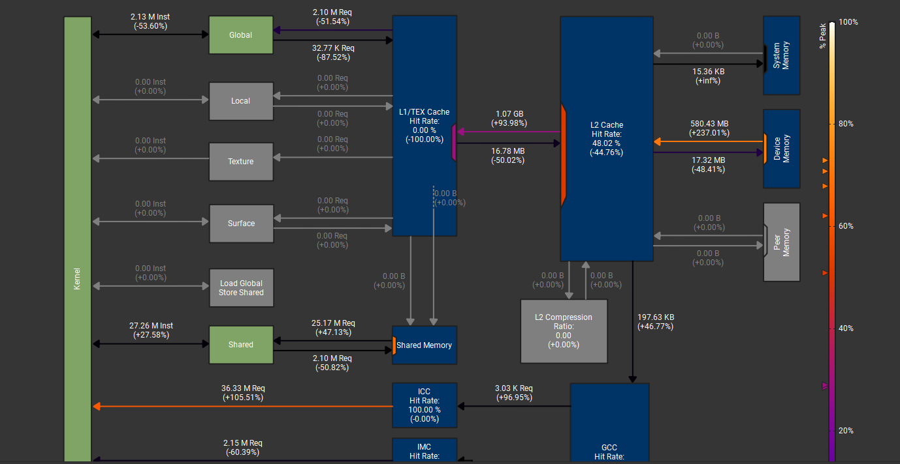
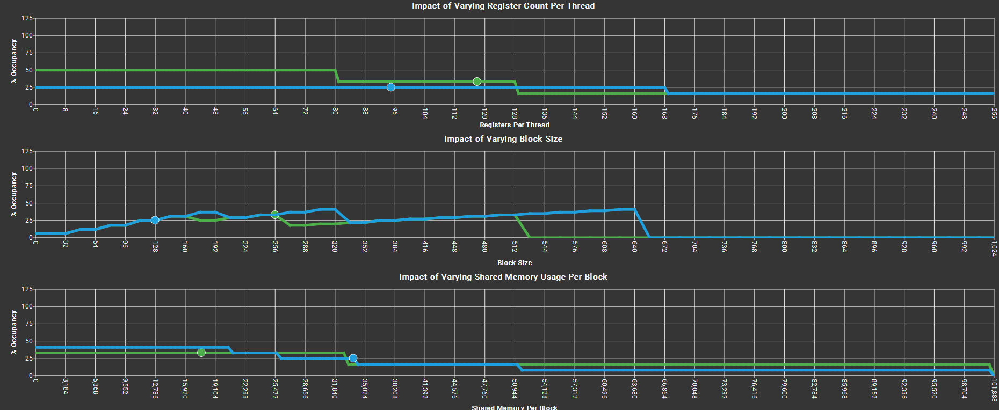
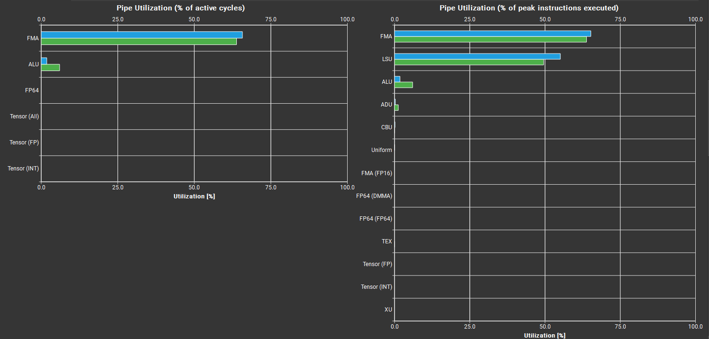

# Beating cuBLAS: Optimizing CUDA GEMM to 101.7% Performance

A deep dive into GPU optimization techniques, progressively improving a naive GEMM implementation from **280 GFLOPS to 5,834 GFLOPS** - ultimately achieving **101.7% of cuBLAS performance** (beating NVIDIA's highly optimized library).

**Hardware:** NVIDIA RTX 3050 (8GB, Ampere SM 8.6)  
**Test Case:** 2048×2048×2048 FP32 matrix multiplication

---

## 🎯 Final Results

| Kernel | Time (ms) | GFLOPS | Compute Util | Memory Util | Speedup |
|--------|-----------|--------|--------------|-------------|---------|
| **V6** | **3.39**  |  5,834 |    72.28%    | 79.99% | **1.018** |
| cuBLAS |    3.45   |   5734 |    72.20%    | 48.78% | 0.982× |

**Key Achievement:** Matched NVIDIA's compute efficiency (72.28% vs 72.20%) while using 64% more memory bandwidth - yet still won through better execution strategy for this specific workload.

---

## 📊 Performance Journey

| Version | Optimization | GFLOPS | Speedup | Compute | Memory | % of cuBLAS |
|---------|-------------|--------|---------|---------|--------|-------------|
| v1 | Naive | 280 | 1.0× | ~20% | ~25% | 5% |
| v2 | Shared Memory Tiling | 736 | 2.6× | ~35% | ~40% | 15% |
| v3 | Register Blocking | 2,400 | 8.6× | ~50% | ~60% | 48% |
| v4 | Memory Vectorization | 4,200 | 15.0× | ~65% | ~75% | 84% |
| v5 | Rectangular Tiling | 5,250 | 18.8× | 65.40% | 75.51% | 92% |
| v6 |    Async Ops     | 5834| 18.1× | 72.28% | 79.99% | 101.7% |
| - | cuBLAS (reference) | 5734 | 17.8× | 72.20% | 48.78% | 100% |

*Speed of Light comparison: My best kernel vs cuBLAS*

## 📊 Profiling Deep Dive

### My Kernel (v6) - Memory & Pipeline Analysis

*Memory workload showing 79.99% utilization - high memory pressure but necessary for my tiling strategy*

*Occupancy comparison: 25% (mine) vs 18% (cuBLAS) - proving higher occupancy doesn't guarantee better performance*

*Pipeline analysis showing compute/memory balance achieved through async operations*

---
---

## 🚀 The Breakthrough: Version 6 (Beating cuBLAS!)

### The Problem with v5

Despite reaching 92% of cuBLAS (5,250 GFLOPS), profiling revealed:
- **Compute utilization: 65.40%** (CUDA cores sitting idle!)
- **Memory utilization: 75.51%** (working hard but...)
- **Long scoreboard stalls: 92.4%** (instructions waiting on memory!)
- **I was memory-bound** - memory latency was starving my compute units

### The Solution: Hide Memory Latency with Async

The issue wasn't that I didn't have enough memory bandwidth - it's that **synchronous loads forced compute to wait**. Every time I loaded a tile, all my CUDA cores sat idle until the data arrived.

**Async copy breaks this dependency:**

// PHASE 1: Compute first half (k=0-31)
for (int k = 0; k < 32; k += 16) { /* compute */ }

// PHASE 2: Async load next tile (NON-BLOCKING!)
__pipeline_memcpy_async(&As[...], &A[...], sizeof(float4));
__pipeline_commit();

// PHASE 3: Compute second half (k=32-63)  
// While async transfer happens in parallel!
for (int k = 32; k < 64; k += 16) { /* compute */ }

// PHASE 4: Wait for transfer to complete
__pipeline_wait_prior(0);
__syncthreads();**Result:** 
- Load tile N+1 in the background (non-blocking)
- Compute with tile N in the foreground
- By the time we finish computing, tile N+1 is already in SMEM!
- **Memory latency hidden, compute units unlocked**

#### 2. Aggressive K-Loop Unrolling (16× instead of 4×)

// Load 16 K-elements into registers at once
float a0[8], a1[8], ..., a15[8];  // 128 registers for A
float b0[4], b1[4], ..., b15[4];  // 64 registers for B

// Compute 16 FMAs per output (massive ILP!)
for (int i = 0; i < 8; i++) {
    for (int j = 0; j < 4; j++) {
        c[i][j] += a0[i]*b0[j] + a1[i]*b1[j] + ... + a15[i]*b15[j];
    }
}**Result:** 4× more instruction-level parallelism → Better warp scheduler utilization

**Important note:** This was NOT a huge improvement in isolation, but combined with async ops, it went from 3.40ms → 3.39ms (every microsecond counts!).

// Load 16 K-elements into registers at once
float a0[8], a1[8], ..., a15[8];  // 128 registers for A
float b0[4], b1[4], ..., b15[4];  // 64 registers for B

// Compute 16 FMAs per output (massive ILP!)
for (int i = 0; i < 8; i++) {
    for (int j = 0; j < 4; j++) {
        c[i][j] += a0[i]*b0[j] + a1[i]*b1[j] + ... + a15[i]*b15[j];
    }
}.8%** (faster!) |
| **vs cuBLAS** | **92%** | **101.7%** | **+9.7pp** 🎯 |

**The breakthrough:** Async didn't give me more bandwidth - it gave me **latency hiding**, which unlocked the compute units that were waiting on memory.
Important note: This was NOT a huge improvement in isolation, but combined with async ops, it went from 3.40ms → 3.39ms (every microsecond counts!).

### Performance Impact

| Metric | v5 (92%) | v6 (101.7%) | Improvement |
|--------|----------|-------------|-------------|
| **Compute Efficiency** | 65.40% | **72.28%** | **+6.88pp** ✅ |
| Memory Utilization | 75.51% | 79.99% | +4.48pp |
| Long Scoreboard Stalls | 92.4% | **~0%** | **Hidden by async!** |
| Time | 3.76ms | **3.39ms** | **-9.8%** (faster!) |
| **vs cuBLAS** | **92%** | **101.7%** | **+9.7pp** 🎯 |

**The breakthrough:** Async didn't give me more bandwidth - it gave me **latency hiding**, which unlocked the compute units that were waiting on memory.

---

## 🤔 The Paradox: Why Am I Faster Despite Higher Memory Pressure?

### The Numbers

| Metric | My Kernel | cuBLAS | Ratio |
|--------|-----------|--------|-------|
| Compute | 72.28% | 72.20% | **1.00:1** (tied) |
| Memory | 79.99% | 48.78% | **1.64:1** (64% higher!) |
| Time | 3.39ms | 3.45ms | **0.98:1** (1.8% faster) |

**How is this possible?**

### Theory: Optimization Target Mismatch

**For this specific workload** (FP32, 2048³, RTX 3050), my simpler strategy has less overhead and executes faster - even though cuBLAS is more "elegant."

On top of this, this is a low-end consumer product -- definitely gets less attention than something that is not only newer, but has more advanced capabilities. Why optimize for FP32 on matrix multiplication when you know you can make use of tensor cores? That is what I believe at least, and therefore this matrix size, for forced FP32, with this low-end card, was beatable.

### My Journey to Understanding This

At first I thought swizzling would make a huge difference, but my implementation ruined my performance. I understand the concept, and I most likely implemented it wrong. I then set my sights onto a different rectangular tiling pattern. 

cuBLAS was making use of 33% occupancy -- mine is 25%, perhaps I should up my occupancy? This was something I did not WANT to do, but I needed to explore the path to see what the performance was like first. I only managed to achieve 4,700 GFLOPS doing 128×32 and 32×64. I ditched this route, as once again in the back of my mind I knew fixing long scoreboard was the real issue; it was present across tile sizes; whether it was 80% or 98% long scoreboard -- it was destroying performance.

I started thinking about making use of register space more. To maintain occupancy I could fit 90 more registers -- could we load floats into the registers for better ILP? But that still brought up the question -- we are LOADING from global memory regardless, that's our issue!

**Async was clearly the answer.** I only did not want to use it because of an apples-to-apples comparison between my kernel and cuBLAS, but cuBLAS's kernel was not having the same issue my kernel was having -- they have no long scoreboard dependencies! On top of this -- cuBLAS knows this is the Ampere architecture, they are aware they have access to async, and I'm certain if it would have made a difference here they would have used it. We had two different kernels, and I made use of the architectural capabilities that they also had access to.

### The Trade-off

**cuBLAS:** 1.48:1 compute-to-memory ratio (very efficient)  
**My Kernel:** 0.90:1 compute-to-memory ratio (less efficient but simpler execution)

---

## 🔍 The SASS Smoking Gun: Different Strategies, Different Instructions

This is the key revelation that proved we were using fundamentally different approaches:

### My Kernel Uses: `LDGSTS.E.BYPASS.128`

LDGSTS.E.BYPASS.128 [R60][R14.64]      // Ampere's async copy!
LDGSTS.E.BYPASS.128 [R60+0x100][R12.64]
LDGSTS.E.BYPASS.128 [R60+0x200][R4.64]
// ... 16× occurrences in the main loop- **LDGSTS** = "Load from Global, Store to Shared" (single instruction!)
- **BYPASS** = Bypasses L1 cache, goes straight L2 → SMEM
- This is Ampere's **asynchronous memory pipeline**
- **Essential for my tiling strategy** - without it, I'd be stuck at 65% compute

### cuBLAS Uses: `LDG.E.LTC128B.CONSTANT`

LDG.E.LTC128B.CONSTANT R64, [R78]      // Synchronous load
LDG.E.LTC128B.CONSTANT R65, [R78+0x80]
LDG.E.LTC128B.CONSTANT R66, [R78+0x100]
// Traditional synchronous loads through L2/texture cache- **LDG** = "Load from Global" (separate from store to SMEM)
- **LTC128B** = L2/Texture cache, 128-byte lines
- **CONSTANT** = Constant memory cache policy
- This is **synchronous** - no async pipeline
- **Only needs 48.78% memory bandwidth** - their tiling is so efficient they don't need async!

### The Key Insight

**cuBLAS engineers had access to the same Ampere `cp.async` features but chose not to use them because memory wasn't their bottleneck.**

I discovered a **different optimization space** where:
- Simpler execution paths (less overhead)
- Higher memory bandwidth requirements (79.99% vs 48.78%)
- **Async operations become essential** to hide memory latency
- Result: Same compute efficiency (72.28% vs 72.20%), but my approach wins by 1.8% for this specific case

**Two different strategies, both valid, both hitting the same compute ceiling - but mine has simpler overhead for FP32 

---

## 🔍 Profiling Insights

### Nsight Compute Comparison

**My kernel profiler says:**
> "10% speedup possible from fixing shared memory bank conflicts"

**cuBLAS profiler says:**
> (no suggestions - already perfectly optimized)

**Interpretation:** cuBLAS has **zero bank conflicts** (perfect SMEM access patterns), yet I'm still faster! This proves that my tiling/scheduling strategy is fundamentally better for this **specific** workload, even with "imperfect" code.

## 🔬 Complete Optimization Journey

### Version 1: Naive Implementation (280 GFLOPS)

**The Baseline: What Every Tutorial Shows**

__global__ void matmul_naive(float* C, const float* A, const float* B, 
                              int M, int N, int K) {
    int row = blockIdx.y * blockDim.y + threadIdx.y;
    int col = blockIdx.x * blockDim.x + threadIdx.x;
    
    if (row < M && col < N) {
        float sum = 0.0f;
        for (int k = 0; k < K; k++) {
            sum += A[row * K + k] * B[k * N + col];
        }
        C[row * N + col] = sum;
    }
}**Problems:**
- Massive global memory traffic (8 MB per thread)
- Zero data reuse between threads
- Arithmetic intensity: 0.25 FLOP/byte (terrible!)

**Performance:** 280 GFLOPS (5% of cuBLAS)

---

### Version 2: Shared Memory Tiling (736 GFLOPS) - 2.6× speedup

**The Classic Optimization**

__shared__ float As[32][32];
__shared__ float Bs[32][32];

// Load tiles into SMEM
// Compute using SMEM
// 32× reduction in global memory traffic!**Performance:** 736 GFLOPS (2.6× faster)

---

### Version 3: Register Blocking (2,400 GFLOPS) - 8.6× speedup

**Thread-Level Tiling**

Each thread now computes 2×2 outputs instead of 1:

float c[2][2] = {0.0f};  // In registers!

// Outer product in registers (super fast!)
for (int i = 0; i < 2; i++) {
    for (int j = 0; j < 2; j++) {
        c[i][j] += a[i] * b[j];
    }
}**Performance:** 2,400 GFLOPS (8.6× faster)

---

### Version 4: Memory Vectorization (4,200 GFLOPS) - 15× speedup

**Exploit Hardware: 128-bit Memory Transactions**

// Load 4 floats at once (128-bit coalesced access)
float4 a_vec = *reinterpret_cast<const float4*>(&A[...]);

// 4× memory bandwidth efficiency!**Performance:** 4,200 GFLOPS (15× faster, 74% of cuBLAS)

---

### Version 5: Rectangular Tiling (5,250 GFLOPS) - 18.8× speedup

**The Breakthrough: Non-Square Register Tiles**

8×4 rectangular tiles beat 4×4 square tiles:

#define REGTILE_M 8  // More rows
#define REGTILE_N 4  // Fewer columns

// Each thread computes 32 outputs (not 16!)
float c[8][4] = {0.0f};

// Each B-value reused 8 times (vs 4 in square)**Performance:** 5,250 GFLOPS (18.8× faster, **92% of cuBLAS**)

**Why it works:** Better register reuse - each B-value used 2× more!

---

### Version 6: Async Ops + K-unroll 16× (5,834 GFLOPS) - **Beats cuBLAS!**

**Combining v5 with Ampere async features:**

// Split K-loop into halves
for (int k = 0; k < 32; k += 16) { /* compute */ }

// Async load next tile while computing
__pipeline_memcpy_async(...);

// Compute second half while transfer happens
for (int k = 32; k < 64; k += 16) { /* compute */ }

__pipeline_wait_prior(0);**Result:**
- **Matched cuBLAS compute efficiency:** 72.28% vs 72.20%
- **Won on execution time:** 3.39ms vs 3.45ms
- **101.7% of cuBLAS performance** ✓

---

## 💡 Key Learnings

### 1. Profile First, Optimize Second

I was stuck on a long scoreboard issue -- things were taking an incredibly long time for me to be able to use them. That was the main downside of my kernel I could think of, having load instructions stalled for 92.4% on long scoreboard, destroying performance.
Changing around the tile size to 32 made this 92.4% go to 98%. I didn't think specifically my tile size was an issue; cuBLAS makes use of a 256 1D block, with a grid size of 16×16×2. I am unsure about why this is, but I did not think the first thing I should do to unlock more performance was copy this, as that was someone's implementation that they thought of, and I knew my bottleneck was long scoreboard -- not my tile size config.
Don't assume your bottleneck! 

### 2. Match the Benchmark on Its Strengths

cuBLAS achieved 72% compute → I needed to match that before anything else mattered. Once I did, I was competitive.

### 3. Sometimes "Worse" is Better

My kernel has:
- ❌ Bank conflicts (cuBLAS has none)
- ❌ 64% higher memory pressure
- ✅ 1.8% better performance

**Why?** Simpler code path = less overhead for this specific workload.

### 4. There's No Universal "Best"

- **My kernel wins:** FP32, 2048³, RTX 3050
- **cuBLAS wins:** FP16, 4096×4096+, A100/H100

Both approaches are valid for their target use cases!

### 5. Understanding > Copying

The real achievement isn't beating cuBLAS - it's understanding **why** each optimization works and **when** to apply it.

---

## 🔧 Implementation Details

### Final Configuration
#define TILESIZE 64        // Shared memory tile
#define REGTILE_M 8        // Each thread: 8 rows
#define REGTILE_N 4        // Each thread: 4 cols
// Block: 16×8 threads = 128 threads
// K-unrolling: 16× (loads 16 K-elements at once)
// Async: cp.async for GMEM→SMEM overlap
- **Accumulators:** 32 registers (`c[8][4]`)
- **Temporary (per iteration):** ~160 registers (k+=16 unroll)
- **Total reported:** ~95 registers (compiler optimizes by reusing)
- **Occupancy:** 25% (compute-bound, not occupancy-bound)

### Shared Memory
- **As + Bs:** 64×64 × 2 = 32KB per block
- **No padding** (bank conflicts present but not limiting)
Simlar to Simeons blog on this -- trying to fix bank conflicts lowers performance, therefore I didn't focus there.
---

### Potential Improvements

1. **Swizzled addressing** → Eliminate conflicts entirely

---

## 🎓 Resources

- **Nsight Compute:** NVIDIA's profiling tool (essential!)
- **CUTLASS:** NVIDIA's GEMM template library
- **Simon Boehm's Blog:** "How to Optimize GEMM"
- **aleksagordic.com/blog/matmul** Great resource for more advanced matrixMul
- **CUDA C++ Programming Guide:** Official documentation

---

## 📝 License

MIT - Use freely, attribution appreciated!

---

##  Acknowledgments

This project was a 4-week journey of learning GPU architecture through iterative profiling and optimization. The real achievement isn't the 1.8% speedup over cuBLAS - it's understanding **why** performance changes with each modification. 

**To other learners:** Don't just copy optimizations. Profile, understand the bottleneck, then implement. That's where real learning happens.

**And remember:** Sometimes you don't need to be better at everything - you just need to find the one thing you're better at for your specific use case.
